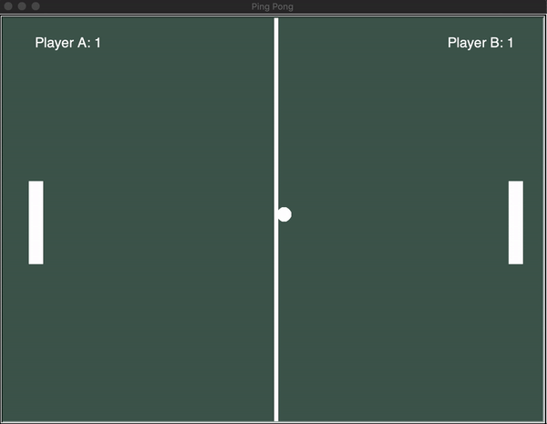
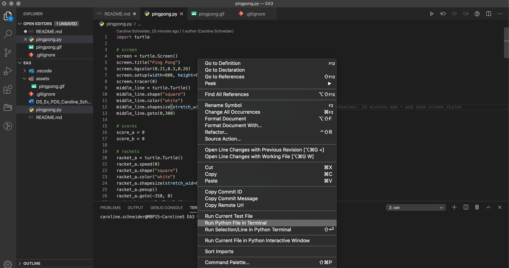

# pingpong

A simple ping pong game for two players.

Player A:
"W" Key: Go Up
"S" Key: Go Down

Player B:
↑ Key: Go Up
↓ Key: Go Down

Run pingpong.py to play.

Hint:
If you're using VS Code you can run the game directly from your IDE (see screenshot below).

